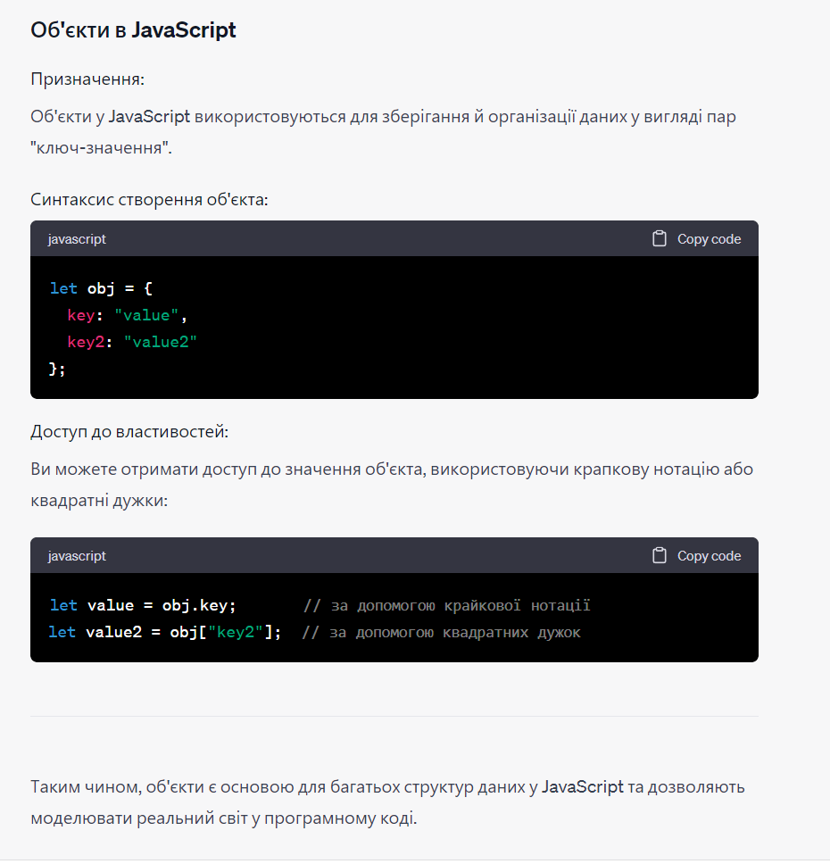
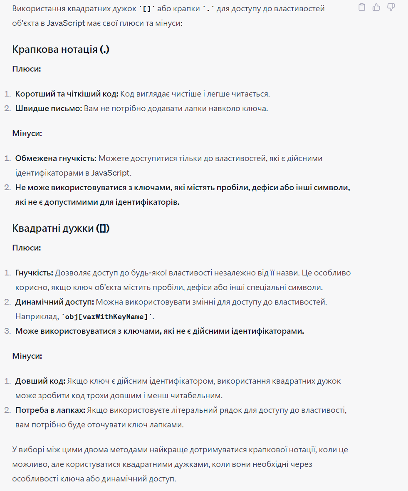
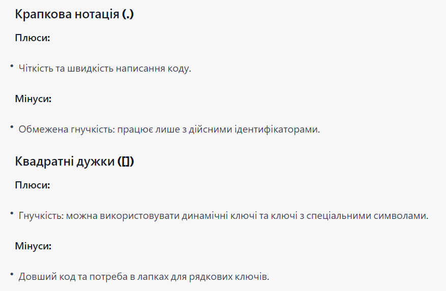

1) Поясни призначення та синтаксис об’єктів у JavaScript

 

2) Які плюси та мінуси використання квадратних дужок ([]) замість крапки (.) для доступу до властивостей об’єкта в JavaScript?.

 

  
Які плюси та мінуси використання квадратних дужок ([]) замість крапки (.) для доступу до властивостей об’єкта в JavaScript?

  <!-- Перший вкладений випадаючий список -->
  

    
Коротка версія

    
  

  <!-- Другий вкладений випадаючий список -->
  

    
Докладна версія

    
  

3) Поясни найбільш вживані методи перевірки наявності у об’єкта певної властивості.

 

4) Поясни способи перебору властивостей об’єкта?

 

5) Поясни 2 способи копіювання об’єкта в Javascript?

 

6) Яка різниця між глибокою та поверхневою копією об’єкта?

 

7) Які є нюанси деструктуризації об'єкта?

 

8) Що таке методи об'єкта? Як їх додавати та використовувати?

 

9) Що таке обчислювані властивості об’єкта? Навіщо вони потрібні?

 

10) Поясни, що означає, що об'єкт є посилальним типом (reference type).

 

